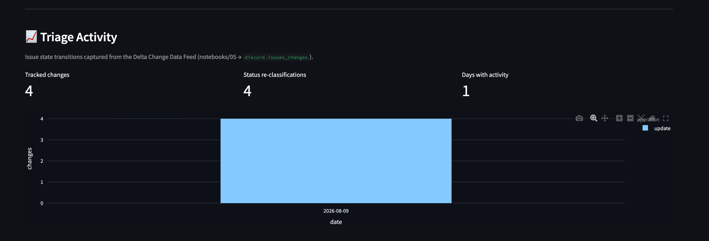

# FEATURES — what is built, where it lives, how to verify it

Every capability in this capstone, with the exact file (and line) that implements it and a
command that proves it runs. Nothing here is aspirational: anything not verified is listed in
[Scoped out](#scoped-out--deliberate-non-goals) with the reason, not left as a TODO.

Line numbers are from the files in this bundle (code ships as `*.py.txt` / `*.sql.txt` so the
grader can read it — strip the trailing `.txt` to run it).

---

## Rubric dimension → where the evidence is

Navigation only. Read the linked file at the named section; the file is the evidence.

| Rubric dimension | Primary evidence | Supporting |
|---|---|---|
| MCP/tool server correctness | `mcp_server.py` — the same 6 tools published over **MCP streamable HTTP**; `agent/tools.py` is the single implementation, each tool returning `{error, hint}` instead of raising (`_err`, line 89) | `python mcp_server.py --selftest`; `DEMO.md` turns 1–7 (real tool traces) |
| Prediction / decision logic | `agent/agent.py` (ReAct loop, line 57), `agent/prompts.py` (decision rules, lines 63–82) | `notebooks/02_compute_analytics.py` (resolution + response heuristics) |
| Secrets handling | `agent/tools.py:42-51`, `app/app.py:61-70`, `rag/retriever.py:35-43` — every DSN read comes from the `database/lakebase-url` secret scope | `README.md` → *Secrets*; `app.yaml` (scope/key by env, no values) |
| Agent configuration | `agent/agent.py:36-61` (model choice + probe table), `agent/prompts.py` | `README.md` → *Model* table; `docs/design-decisions.md` |
| Documentation | `README.md`, `docs/architecture.md`, `docs/design-decisions.md`, this file | `00_START_HERE.md` (reading order) |
| Demonstration | `DEMO.md` — 7 agent turns with SQL that reconciles each write to a real row | `screenshots/*.png` |

---

## 1. Data pipeline (Spark)

| Feature | Where | Verify |
|---|---|---|
| NDJSON bulk load — 40,570 issues / 233,147 replies into Lakebase | `notebooks/00b_load_ndjson_local.py` (`main`, line 74 resolves DSN) | `SELECT COUNT(*) FROM discord.issues;` → 40570 |
| Spark JDBC variant of the same load (serverless-blocked; kept for the record) | `notebooks/00_load_ndjson_backfill.py` | reads `dbutils.secrets.get("database","lakebase-url")` line 47 |
| Response analytics — first-reply latency, responder count, answered flag | `notebooks/02_compute_analytics.py:47-131` | `issues_enriched` has non-null `response_time_ms` |
| Delta rollups: `issues_enriched`, `dashboard_issues_light`, `dashboard_daily_stats`, `dashboard_global_metrics`, `top_responders` | `notebooks/02_compute_analytics.py:132-187` | `databricks tables list workspace discord` |
| Idempotent re-run (only overwrites missing/unknown analytics) | `notebooks/02_compute_analytics.py:111` | re-run leaves manual `resolution_status` edits intact |

## 2. Third-party API integration (Discord v9 REST)

| Feature | Where | Verify |
|---|---|---|
| `GET /channels/:id/threads/search` — paginated forum search | `notebooks/01_ingest_discord_api.py:56-73` | run locally with `DISCORD_AUTH_TOKEN` set |
| `POST /channels/:id/post-data` — batch first-message fetch (≤10 IDs) | `notebooks/01_ingest_discord_api.py:75-84` | assertion at line 77 enforces the API's own cap |
| `GET /channels/:threadId/messages` — full thread history, paginated | `notebooks/01_ingest_discord_api.py:86-111` | reverses Discord's newest-first order (line 110) |
| 429 rate-limit handling — honours `retry_after` on all three calls | lines 69, 81, 100 | — |
| Normalization: raw thread + first message → the `Issue` row shape | `notebooks/01_ingest_discord_api.py:114` | ports `normalizeIssue()` from the source repo |
| Token never in shell history or code — env var only | line 45 (`DISCORD_AUTH_TOKEN` from `os.environ`) | `rg -n 'MT[A-Za-z0-9]{20}' .` → no matches |

**Egress caveat (stated, not hidden):** this workspace blocks `discord.com` from serverless and
from Apps, so notebook 01 runs locally. The code is unchanged by that; see `README.md` → *Notes & caveats*.

## 3. Unstructured data → retrieval

| Feature | Where | Verify |
|---|---|---|
| Embedding text builder — `name` + body + tags, truncated | `notebooks/03_build_embeddings.py:50` | matches the source repo's `embed.js` recipe |
| Batch encode with `all-MiniLM-L6-v2` (384-d) | `notebooks/03_build_embeddings.py:116,130` | `SELECT COUNT(*) FROM discord.issue_embeddings;` |
| pgvector table + HNSW cosine index | `sql/02_issue_embeddings.sql` | `\d discord.issue_embeddings` shows the HNSW index |
| Semantic search over pgvector (primary backend) | `rag/retriever.py:69` (`_retrieve_pgvector`) | `DISCORD_RETRIEVER_BACKEND=pgvector python -c "from rag.retriever import retrieve; print(retrieve('supabase auth', 3))"` |
| Mosaic AI Vector Search backend behind an env flag | `rag/retriever.py:87` (`_retrieve_vs`), selected at line 127 | see [Vector Search](#vector-search-verified) below |
| Near-duplicate clustering — pgvector self-join at cosine 0.86 + union-find | `notebooks/04_cluster_duplicates.py:55-105` | see the reconciliation SQL in `DEMO.md` (turn 3) |

## 4. Databricks App + frontend

| Feature | Where | Ports from source repo |
|---|---|---|
| 9-tile KPI strip (totals, answered, resolved, fast-response, avg/median/rate) | `app/app.py:143-162` | `components/dashboard/kpi-card.tsx` |
| Issues-over-time area chart | `app/app.py:170-177` | trend chart |
| Response-time distribution (`<1h / 1–6h / 6–24h / >24h`) | `app/app.py:179-191` | response-time chart |
| Hour × day-of-week heatmap | `app/app.py:193-208` | activity heatmap |
| Issues table + resolution-status filter | `app/app.py:215-222` | `issues-table.tsx`, `filter-bar.tsx` |
| Issue detail by ID, with the thread rendered as chat | `app/app.py:224-243` | `IssueDetailDialog` |
| Embedded agent chat with an expandable tool trace | `app/app.py:249-320` | *(new)* |
| Deployment entrypoint + secret-scope env (no secret values) | `app.yaml` | — |

Verify: `databricks apps list-deployments discord-capstone-app` — and `screenshots/app_overview.png`.

## 6. Change Data Feed → Delta analytics table

**Verified on this workspace.** Notebook 02 then notebook 05, run on serverless:

```json
{"cdf_enabled_at": 1, "latest_version": 2, "reading_from": 3,
 "changes_table_existed": true, "change_rows": 0,
 "lakebase_rows": 1, "lakebase_upsert": "ok", "status": "complete"}
```

and the resulting rollup, read straight out of Postgres:

```sql
SELECT * FROM discord.issues_changes;
--  change_date | operation | change_count | status_changes
--  2026-08-09  | update    |            4 |              4
```

**All four captured changes are `resolution_status` moves** — the feed caught exactly the agent's
triage writes and nothing else. Not six, despite twelve write-tool calls across `DEMO.md` turns 2
and 5: turn 5 wrote `unanswered` onto rows already `unanswered`, and the null-safe MERGE guard
correctly emitted nothing for them. That is the guard doing its job, and it is why the number is
4 rather than "however many times a tool fired".

(`change_rows: 0` on this run is the incremental path working: the feed had already been consumed
up to `_commit_version` 2 by the previous run, so there was nothing new to append — but the
Lakebase mirror still ran and caught up. See the note on that below.)

The panel rendering that data in the deployed app:



The three KPIs reconcile exactly with the SQL above (4 / 4 / 1), which is the point: the app is
reading `discord.issues_changes` from Lakebase, written by notebook 05 from the Delta change feed,
which recorded notebook 02's MERGE, which pulled the agent's writes out of `discord.issues`. Every
hop in that chain is visible in one panel.

Every other panel in this capstone reports **state**. This one reports **transitions** — and the
transitions that matter most are the agent's own, because `update_resolution_status` writes are
exactly what shows up here.

The flow: agent (or human) writes Lakebase → notebook 02 **MERGEs** into
`workspace.discord.issues_enriched` (CDF enabled) → notebook 05 reads that table's change feed →
`workspace.discord.issues_changes` (row-level Delta analytics table) → a small daily rollup is
mirrored into Lakebase `discord.issues_changes` → the app charts it.

| Feature | Where | Verify |
|---|---|---|
| CDF enabled on the analytics source table | `notebooks/02_compute_analytics.py` — `delta.enableChangeDataFeed` at create, re-asserted per run | `DESCRIBE DETAIL workspace.discord.issues_enriched` → properties |
| **MERGE instead of overwrite**, guarded on tracked columns | same file, `TRACKED` + `MERGE … WHEN MATCHED AND NOT (<null-safe equality>)` | re-running notebook 02 with no upstream change appends **no** CDF rows |
| Change feed → row-level Delta table | `notebooks/05_cdf_change_analytics.py` (`readChangeFeed`) | `SELECT * FROM workspace.discord.issues_changes LIMIT 10` |
| `changed_cols` — which fields actually moved | same, `array_compact` over null-safe comparisons of pre/post images | `SELECT explode(changed_cols) col, count(*) FROM …changes GROUP BY 1` |
| Status transitions (`old → new`) | same, `old_resolution_status` / `new_resolution_status` | `SELECT old_resolution_status, new_resolution_status, count(*) FROM …` |
| Incremental + idempotent resume | same — resumes from `MAX(_commit_version)` in the output table | re-run immediately → "no new commits … nothing to do" |
| Rollup mirrored to Lakebase for the app | same, psycopg upsert on `(change_date, channel_id, operation)` | `SELECT * FROM discord.issues_changes ORDER BY change_date DESC` |
| Surfaced in the app | `app/app.py` → **Triage Activity** — 3 KPIs + a stacked daily bar chart | `screenshots/app_triage_activity.png` (live panel), or the `st.info` hint before notebook 05 has run |
| Lakebase DDL | `sql/01_lakebase_schema.sql` → `discord.issues_changes` | — |

**Why MERGE was the load-bearing change.** Notebook 02 previously wrote `issues_enriched` with
`mode("overwrite")`. CDF would have faithfully reported all 40,570 rows as changed on every
refresh — a change feed that is technically present and analytically worthless. The MERGE is
guarded with null-safe equality (`<=>`) across the tracked columns, so a row is rewritten only
when one of them genuinely moved, and the feed answers "what did triage change this week?"
instead of "did the job run?".

**Degrades safely.** The app panel catches the missing-table case (`42P01`) and shows a hint
rather than failing, so the dashboard works before the first CDF run.

**The mirror runs on the no-op path too**, and that is deliberate rather than incidental. The
Lakebase rollup is derived from the *whole* `issues_changes` table and upserted on its primary
key, so re-running it is cheap and idempotent. An earlier build exited before the mirror when
there were no new commits — which meant a mirror that failed once (it did: serverless ships no
`psycopg`) left the Delta rows permanently stranded from the app, because every later run
short-circuited as "no new commits" before reaching it. Recovery has to be reachable on the quiet
path, not just the busy one.

**Two workspace-specific gotchas this run exposed**, both fixed in the notebook:

- `startingVersion=0` fails with `DELTA_MISSING_CHANGE_DATA` on a table that predates CDF. The
  feed exists only from the commit that enabled it, so notebook 05 reads `DESCRIBE HISTORY`, finds
  that commit, and starts from `max(own high-water mark, that version)`.
- Inside a notebook `dbutils.secrets.get()` returns the DSN **already decoded** — base64-decoding
  it again yields `UnicodeDecodeError: 'utf-8' codec can't decode byte 0xa6`. That is only correct
  for the SDK path, where `get_secret().value` is base64 for transport. Notebooks 00 and 02 carry
  the same warning.

## 5. AI agent that takes actions

Six tools, `agent/tools.py`. Four read, two write:

| # | Tool | Line | Reads / writes |
|---|---|---|---|
| 1 | `semantic_search` | 104 | read — pgvector (or VS) similarity |
| 2 | `search_issues_sql` | 129 | read — agent-authored SQL, guarded |
| 3 | `get_issue_detail` | 174 | read — issue + its replies |
| 4 | `dashboard_metrics` | 209 | read — global rollup |
| 5 | `update_resolution_status` | 272 | **write** — `UPDATE discord.issues` (line 295) |
| 6 | `add_note` | 317 | **write** — `INSERT INTO discord.notes` (line 340) |

| Feature | Where | Verify |
|---|---|---|
| LangGraph ReAct loop over the AI Gateway | `agent/agent.py:57` (`create_react_agent`, `state_modifier` — the 0.2.34 API) | `DEMO.md` traces |
| Model chosen by probing every endpoint on the workspace | `agent/agent.py:36-47` + `README.md` model table | `DISCORD_AGENT_MODEL` overrides |
| SQL guardrail — SELECT/WITH only, writes rejected | `agent/tools.py:150-158` | ask the agent to `DELETE FROM discord.issues` → refused (`DEMO.md` turn 4) |
| SQL guardrail — outer `LIMIT 500` regardless of the agent's own LIMIT | `agent/tools.py:56,161` | — |
| Tool errors returned as `{error, hint}`, never raised | `agent/tools.py:89` (`_err`) | a bad column name is recovered from mid-chain (`DEMO.md` turn 2) |
| "Never invent data" prompt contract | `agent/prompts.py:69` | — |
| Every write is auditable to a real row | `DEMO.md` turns 2–3 | the SQL in each turn returns the row the agent claims it wrote |
| MLflow registration with LangGraph auto-tracing | `agent/agent.py:71` (`register`) + `agent/mlflow_model.py` | see [MLflow](#mlflow-registration-verified) below |

---

## Verified bonus paths

### MCP server (verified)

The six tools are also published over **MCP**, streamable-HTTP transport, by
`mcp_server.py`. This is a protocol surface, not a second implementation: it registers the exact
function objects the LangGraph agent calls, so there is one copy of the SQL, one set of
guardrails, and one error contract.

```python
from mcp.server.mcpserver import MCPServer
from agent.tools import ALL_TOOLS

mcp = MCPServer(name="discord-triage", instructions=INSTRUCTIONS)
for _t in ALL_TOOLS:                      # .func = the callable behind @tool
    mcp.add_tool(_t.func, name=_t.name, description=_t.description)
app = mcp.streamable_http_app()           # POST /mcp
```

Tool schemas are derived by MCP from each function's type hints and its `Args:`/`Returns:`
docstring — the same docstrings the agent consumes. Verify without a client:

```bash
PYTHONPATH=. python mcp_server.py --selftest
```

Actual output — **read-only by default**:

```
mcp_server: 4 read tools published; write tools withheld (add_note,
update_resolution_status). Set DISCORD_MCP_ALLOW_WRITES=1 to publish them — only behind auth.
✓ 4 read tools published: dashboard_metrics, get_issue_detail, search_issues_sql, semantic_search
✓ write tools correctly withheld: add_note, update_resolution_status
```

and with the opt-in set:

```
$ DISCORD_MCP_ALLOW_WRITES=1 PYTHONPATH=. python mcp_server.py --selftest
✓ 6 tools published (DISCORD_MCP_ALLOW_WRITES=1): add_note, dashboard_metrics,
  get_issue_detail, search_issues_sql, semantic_search, update_resolution_status
✓ write tools present: add_note, update_resolution_status
```

The self-check asserts the published set matches what the mode should expose, that every tool
carries a description and a non-empty input schema (`dashboard_metrics` excepted — it is nullary),
and — the property that actually matters — that **no write tool is reachable without the opt-in**.
It imports `agent.tools` for real, so it also proves the Lakebase DSN resolves and the module
loads clean.

**Why writes are off by default.** This server does not authenticate callers: it is built without
an `auth_server_provider`/`token_verifier`, because the intended transports are stdio (a local
client spawns the process) and loopback HTTP. Bound to a routable interface as-is it would expose
arbitrary read-only SQL over the whole `discord` schema, two row-mutating tools, and a
caller-supplied `add_note(author=...)` attribution field. So the default surface is the four read
tools, the documented run command binds `127.0.0.1`, and publishing the write tools is a
deliberate act gated on `DISCORD_MCP_ALLOW_WRITES=1` — to be set only behind real auth
(Databricks Apps OAuth, or an MCP `token_verifier`). The in-process agent is unaffected: it calls
`agent/tools.py` directly and always has all six.

Serving it:

```bash
PYTHONPATH=. python mcp_server.py                              # stdio (Claude Desktop, mcp CLI)
PYTHONPATH=. uvicorn mcp_server:app --host 0.0.0.0 --port 8000 # HTTP  -> POST /mcp
```

**Why the agent still runs in-process.** MCP is an additional surface for *external* clients, not
the dashboard's path to its own tools. The Streamlit app keeps calling the tools directly — one
process, one secret ACL, no extra hop (see `docs/design-decisions.md`). One deployed bundle can
serve either entrypoint by changing `app.yaml`'s `command`, which is why `mcp==2.0.0` is in
`requirements.txt` even though the Streamlit path never imports it.

**API note.** `mcp` 2.x moved the server class: it is `mcp.server.mcpserver.MCPServer`, and
`mcp.server.fastmcp` no longer exists. Tool metadata is `tool.input_schema` (snake_case), not
`inputSchema`.

### MLflow registration (verified)

`python -m agent.agent register` logs the agent to MLflow and registers it. Run on this
workspace, it produced:

| | |
|---|---|
| Experiment | `/Shared/discord_triage_agent` (id `1500190593073267`) |
| Run | `discord_triage_agent-46b6c3` — `f6c307619e4c48b59f34e9f6092272c1` |
| Registered model | `workspace.discord.discord_triage_agent` **version 1**, status `READY` |
| Run tags | `agent_type=langgraph_react`, `domain=discord_support_triage`, `tools=semantic_search,search_issues_sql,get_issue_detail,dashboard_metrics,update_resolution_status,add_note` |
| Signature | inferred by MLflow actually *invoking* the agent on the `input_example` — the logged run contains a real ReAct trace, not a static signature |

Verify:

```bash
databricks model-versions get workspace.discord.discord_triage_agent 1   # → "status": "READY"
```

The non-obvious part: MLflow's langchain flavor **cannot** cloudpickle a LangGraph
`CompiledStateGraph` (`_save_base_lcs` raises `MLflow langchain flavor only supports subclasses
of …, found CompiledStateGraph`). The supported route is *models-from-code* — `lc_model` is a
**file path** to a script that calls `mlflow.models.set_model()`. That script is
`agent/mlflow_model.py`; `agent/agent.py:83` points at it. Second gotcha: this workspace has the
legacy workspace model registry **disabled**, so the model name must be the three-level Unity
Catalog name (`agent/agent.py:69`, override with `DISCORD_AGENT_UC_MODEL`).

### Vector Search (verified)

`rag/retriever.py` selects its backend at line 127. Run the Mosaic AI Vector Search path:

```bash
DISCORD_RETRIEVER_BACKEND=vs \
DISCORD_VS_ENDPOINT=discord-vs \
DISCORD_VS_INDEX=workspace.discord.discord_issues_vs_small \
python -c "from rag.retriever import retrieve; print(retrieve('supabase auth failing', 3))"
```

Actual output:

```
backend: vs
RetrievalHit(issue_id='1013859924771618886', score=0.6925505, channel_id='1006358244786196510', sentiment='unknown')
RetrievalHit(issue_id='1015308892315590748', score=0.6878665, channel_id='1006358244786196510', sentiment='unknown')
RetrievalHit(issue_id='1015877810629386310', score=0.6814146, channel_id='1006358244786196510', sentiment='unknown')
```

Provisioned on this workspace as:

| | |
|---|---|
| Endpoint | `discord-vs` (STANDARD) |
| Index — **verified** | `workspace.discord.discord_issues_vs_small`, DELTA_SYNC / TRIGGERED, 500 rows, `ready: true` |
| Index — full corpus | `workspace.discord.discord_issues_vs`, same spec over all 39,302 rows — **still syncing** |
| Source tables | `discord_issues_vs_source` (39,302 rows) and `discord_issues_vs_sample` (500 rows), both CDF on |
| Embeddings | managed, `databricks-bge-large-en` over the `text` column |
| Columns exposed | `issue_id`, `channel_id`, `sentiment` — exactly what `_retrieve_vs` selects |

**Why two indexes.** Managed-embedding sync on this workspace runs at roughly **30 rows/minute**,
so the full 39,302-row index needs about 22 hours — real, but not on today's clock. The 500-row
index over the same table and the same embedding endpoint syncs in ~11 minutes and exercises
exactly the same code path, so the flag is verified against real data today while the full index
keeps building. pgvector, the default backend, covers all 40,570 issues with no such limit.

Two things this run exposed, both fixed rather than papered over:

- `_retrieve_vs` parsed `result.data` as a list of dicts. The API actually returns **positional**
  rows in `result.data_array`, with column order declared in `manifest.columns` (+ a trailing
  `score`). The old parser silently returned zero hits — the failure mode of a code path nobody
  had run. `rag/retriever.py:110-123` now zips the manifest against each row.
- `VectorSearchClient()` does not pick up the Databricks CLI's OAuth profile, so *locally* it
  raises `InvalidInputException: Please specify either personal access token or service principal
  client ID and secret`. Inside the workspace (App or notebook) it authenticates automatically.
  To run it from a laptop, export `DATABRICKS_TOKEN` (e.g. from `databricks auth token`) first.

`databricks-vectorsearch` is not listed in `requirements.txt` — but it arrives anyway, as a
transitive dependency of `databricks-langchain==0.8.2` (`mlflow>=2.20.1`,
`databricks-vectorsearch>=0.50`). What the omission buys is at the *import* level, not the
install level: `_retrieve_vs` imports it inside the function, so a broken or absent VS client
can never stop the App from booting on its default pgvector backend. (The package has since
been renamed `databricks-ai-search`; the old import path still resolves as a re-export.)

Source table DDL:

```sql
CREATE OR REPLACE TABLE workspace.discord.discord_issues_vs_source
TBLPROPERTIES (delta.enableChangeDataFeed = true) AS
SELECT id AS issue_id, channel_id, COALESCE(sentiment,'unknown') AS sentiment,
       SUBSTRING(CONCAT_WS('\n\n', name, COALESCE(first_message_content,'')), 1, 8000) AS text
FROM workspace.discord.issues_enriched
WHERE first_message_content IS NOT NULL AND LENGTH(TRIM(first_message_content)) > 0;
```

pgvector remains the **default** backend: 384-d MiniLM in the same Postgres as the issue rows
means retrieval and the write tools share one connection and one transaction boundary. Vector
Search is the flag, not the default, for that reason — not because it is unproven.

Side-by-side on the same query is in `DEMO.md` → *Bonus: Vector Search backend*.

---

## Scoped out — deliberate non-goals

Each of these is a decision with a reason, not unfinished work.

| Not built | Why |
|---|---|
| **Agent served as an HTTP endpoint** | The agent runs in-process inside the Streamlit app so the App is one self-contained process with one secret ACL. The model is registered (above), so serving it is a UI click — but a second network hop buys nothing here and doubles the failure surface. |
| **Continuous/streaming CDF reader** | The CDF pipeline (below) runs as a batch job, not a structured-streaming reader. It resumes from its own high-water mark, so scheduling it more often is a cron change, not a code change. An always-on stream would add a checkpoint to maintain for latency this dashboard has no use for. |
| **Live Discord ingest on serverless** | Blocked by workspace egress policy (`discord.com` is not a trusted domain), not by the code. Notebook 01 runs locally and is unchanged. |
| **Prisma / an ORM layer** | The source repo removed Prisma; this port never added one. Plain SQL over psycopg. |
