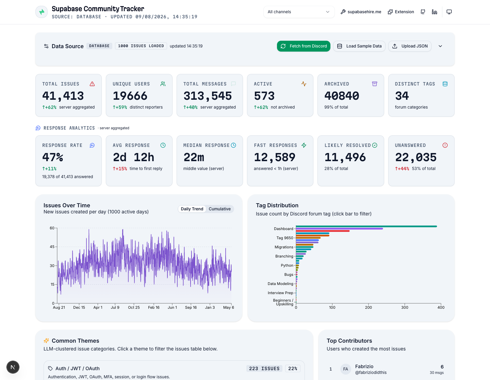

# Databricks AI Capstone — Discord Solution Data Engine

A Databricks port of the **Discord support-forum analytics solution** (`../`), built to satisfy
every requirement of the "Rise of the AI Data Engineer" capstone. The Discord repo is the
**standard**: every component here is a one-to-one port of an existing piece of that solution,
retargeted to the Databricks platform — with one net-new addition (the tool-using agent).

Real data ships with it: the NDJSON dumps in
`../supabase/backups/hosted-discord-schema-2026-07-25/` (**40,570 issues** / **233,147 replies**)
load straight into Lakebase, so there is real volume from day one — no scraping, no synthetic data.

---

## Capstone requirements → how this satisfies them

| # | Requirement | Where it lives | Ported from (Discord repo) |
|---|---|---|---|
| 1 | **Data pipeline in Spark** | `notebooks/00–04` | `src/lib/data-loader.ts`, `discord-api.ts`, `computeResponseAnalytics` |
| 2 | **Third-party API integration** | `notebooks/01_ingest_discord_api.py` | `src/lib/discord-api.ts` (Discord v9 REST) |
| 3 | **Unstructured data → retrieval** | `notebooks/03_build_embeddings.py`, `rag/retriever.py` | `cloudflare-cron/src/embed.js` (→ Mosaic AI Vector Search) |
| 4 | **Databricks App + frontend** | `app/app.py` | `src/app/page.tsx`, `components/dashboard/*` (→ Streamlit) |
| 5 | **AI agent that takes actions** | `agent/{tools,agent,prompts}.py` | *(new — fills a gap in the Discord repo)* |

Plus the shared architectural skeleton: **relational tables in Lakebase** (`sql/01_lakebase_schema.sql`),
**embeddings over unstructured text** for semantic retrieval, and an **agent with read/write tools**.

---

## The source solution this ports from

The "Ported from" column above is not aspirational — the Discord repo at `../` is a running
Next.js/React dashboard over Supabase Postgres. It is the thing being retargeted, and the
Streamlit app in `app/app.py` reproduces its KPI tiles and charts on Databricks.



*(`screenshots/source_react_dashboard_full.png` is the same page captured full-height, showing the
theme/sentiment/duplicate sections the Streamlit port condenses.)*

| | Source (Next.js + Supabase) | This capstone (Streamlit + Lakebase) |
|---|---|---|
| Frontend | React 19 / Next.js App Router | Streamlit (`app/app.py`) |
| Store | Supabase Postgres, schema `discord` | Lakebase Postgres 16 + pgvector, same schema |
| KPI rollups | SQL views (`dashboard_global_metrics`) | Delta rollups (`notebooks/02`) + direct SQL |
| Embeddings / clustering | Cloudflare Workers AI + Vectorize (`bge-base-en-v1.5`, 768-d) | `all-MiniLM-L6-v2` (384-d) into pgvector HNSW |
| Agent | *(none)* | LangGraph ReAct, 6 tools (`agent/`) |

**Why the two figure sets differ.** The source dashboard shows **41,413 issues / 19,666 users /
313,545 messages / 47% response rate**; this capstone reports **40,570 / 19,048 / 306,922 / 48%**.
Two reasons, both expected: the capstone loads the frozen NDJSON snapshot from
`../supabase/backups/hosted-discord-schema-2026-07-25/` (the live dashboard has kept ingesting
since), and the live dashboard aggregates **multiple** Discord channels while the capstone loads
the single support forum `1006358244786196510`. Neither set is wrong; they are different scopes of
the same pipeline.

---

## Architecture in one diagram

```
                 ┌──────────────────────────┐   ┌─────────────────────────┐
   NDJSON dumps  │ issues.ndjson.gz         │   │  Discord v9 REST API    │
   (40k/233k)    │ replies.ndjson.gz        │   │  threads/search,        │
                 └─────────────┬────────────┘   │  post-data, messages    │
                               │                └───────────┬─────────────┘
                               │  one-time                  │  scheduled
                               ▼                            ▼
   ┌─────────────────────────────────────────────────────────────────────┐
   │  SPARK PIPELINE  (notebooks/00 → 04)                                 │
   │  ingest → normalize → compute analytics → embed → cluster            │
   └────────────┬────────────────────────────┬───────────────────────────┘
                │ writes (OLTP)               │ writes (OLAP, append)
                ▼                             ▼
   ┌──────────────────────────┐   ┌──────────────────────────────────────┐
   │  Lakebase (Postgres)     │   │  Delta tables (Unity Catalog)        │
   │  issues, replies,        │   │  daily_stats, global_metrics,        │
   │  notes, duplicate_       │   │  issues_enriched, embeddings          │
   │  clusters, theme_clusters│   └───────────────┬──────────────────────┘
   └─────────────┬────────────┘                   │
                 │ source-of-truth                │ Delta Sync
                 │                                ▼
                 │              ┌──────────────────────────────────────┐
                 │              │  Mosaic AI Vector Search index        │
                 │              │  (discord_issues_vs, bge-large)       │
                 │              └───────────────┬──────────────────────┘
                 │                              │
                 │         ┌────────────────────┴───────────────┐
                 └────────►│  AI Agent (LangGraph + MLflow)       │
                           │  tools: semantic_search, sql,        │
                           │  detail, metrics + 2 write tools     │
                           └───────────────┬──────────────────────┘
                                           │
                                           ▼
                           ┌───────────────────────────────────────┐
                           │  Streamlit Databricks App              │
                           │  KPIs · charts · filter · agent chat   │
                           └───────────────────────────────────────┘
```

See [`docs/architecture.md`](docs/architecture.md) for the expanded flow and
[`docs/design-decisions.md`](docs/design-decisions.md) for the rationale.

---

## Setup — build order (verified on this workspace)

> Commands use the Databricks CLI (`databricks auth login`). The workspace uses the
> `workspace` catalog (not `main`), the `bootcamp-lakebase` Lakebase (PG16, pgvector ON),
> and the `database/lakebase-url` secret (base64-encoded full DSN, connects as `student`).

1. **Lakebase schema** (run as admin; `student` already has DML grants):
   ```bash
   databricks psql bootcamp-lakebase -- -f sql/01_lakebase_schema.sql
   databricks psql bootcamp-lakebase -- -f sql/02_issue_embeddings.sql   # pgvector table
   ```

2. **One-time backfill** — load the NDJSON dumps into Lakebase locally (serverless blocks
   generic Spark-JDBC writes; psycopg is the approved path):
   ```bash
   LAKEBASE_DSN="$(...)" uv run --with 'psycopg[binary]' --with databricks-sdk \
     python notebooks/00b_load_ndjson_local.py
   ```
   (`LAKEBASE_DSN` is the plaintext DSN decoded from the `database/lakebase-url` secret.)

3. **Analytics rollups** (Req 1 Spark pipeline) — notebook `02_compute_analytics.py`,
   run on serverless (reads Lakebase via JDBC, writes Delta to `workspace.discord`).

4. **Embeddings** (Req 3) — run locally (writes to Lakebase via psycopg):
   ```bash
   LAKEBASE_DSN="$(...)" uv run --with 'sentence-transformers' --with 'psycopg[binary]' \
     --with databricks-sdk python notebooks/03_build_embeddings.py
   ```

5. **Duplicate clustering** — notebook `04_cluster_duplicates.py` (pgvector self-similarity
   + union-find, writes clusters to Lakebase via psycopg). Run locally after embeddings.

6. **Live Discord ingest** (Req 2) — notebook `01_ingest_discord_api.py`, run **locally**
   (`discord.com` is egress-blocked from serverless):
   ```bash
   DISCORD_AUTH_TOKEN='...' DISCORD_CHANNEL_ID='...' LAKEBASE_DSN="$(...)" \
     uv run --with 'requests' --with 'psycopg[binary]' python notebooks/01_ingest_discord_api.py
   ```

7. **App** (Req 4) — `app/app.py` + `agent/` (Req 5, embedded). Deploy:
   ```bash
   databricks apps deploy discord-capstone-app \
     --source-code-path /Workspace/Users/<you>/discord-capstone-app --mode SNAPSHOT
   ```
   The app reads `database/lakebase-url` itself (its SP needs a READ ACL on the `database`
   secret scope). `app.yaml` at the source root sets the streamlit entrypoint.

---

## Project layout

```
databricks-capstone/
├── README.md                         ← you are here
├── app.yaml                          ← Databricks App entrypoint + env (streamlit run app/app.py)
├── requirements.txt                  ← pinned deps (app runtime installs from here)
├── docs/
│   ├── architecture.md               ← end-to-end data flow + component map
│   └── design-decisions.md           ← why Lakebase/Delta, model & framework choices
├── sql/
│   ├── 01_lakebase_schema.sql        ← Lakebase DDL (ported from hosted Supabase backup)
│   └── 02_issue_embeddings.sql       ← pgvector embeddings table + HNSW index
├── notebooks/
│   ├── 00_load_ndjson_backfill.py    ← load NDJSON dumps → Lakebase (Spark JDBC; serverless-blocked)
│   ├── 00b_load_ndjson_local.py      ← local psycopg fallback for 00 (the approved path)
│   ├── 01_ingest_discord_api.py      ← Discord v9 REST ingest (self-contained; runs locally)
│   ├── 02_compute_analytics.py       ← response analytics + Delta rollups (Spark, serverless)
│   ├── 03_build_embeddings.py        ← pgvector embeddings (local sentence-transformers)
│   └── 04_cluster_duplicates.py      ← near-duplicate clustering (pgvector + union-find)
├── rag/
│   └── retriever.py                  ← pgvector semantic search (VS behind env flag)
├── agent/
│   ├── tools.py                      ← 6 tools: 4 read + 2 write (psycopg → Lakebase)
│   ├── prompts.py                    ← system prompt
│   └── agent.py                      ← LangGraph ReAct agent + MLflow registration
└── app/
    ├── app.py                        ← Streamlit dashboard + embedded agent chat
    └── requirements.txt              ← pinned deps for Databricks Apps
```

---

## Notes & caveats

- **Egress limitation (important).** This workspace blocks outbound calls to non-trusted
  domains from both serverless compute and Databricks Apps (Enterprise-tier network policy).
  `discord.com` is blocked — the same restriction that hit `api.massive.com` / `api.weather.gov`
  in the bootcamp. Consequences, all worked around:
  - **Bulk data load is via NDJSON, not live scraping.** Notebook `00b_load_ndjson_local.py`
    loads the 40k/233k-row dumps into Lakebase over psycopg. Notebook 02 (Spark → Delta) is the
    Req-1 pipeline and runs fine on serverless.
  - **Notebook 01 (live Discord ingest) runs locally**, not on serverless. The code is correct
    and self-contained (env-based config, psycopg writes) wherever egress is permitted; run it
    locally with `DISCORD_AUTH_TOKEN` + `DISCORD_CHANNEL_ID` set to demonstrate the live v9 API
    integration. The Databricks App itself only reaches Lakebase and the in-workspace LLM
    gateway — no `discord.com` — so the block does not affect it.
- **pgvector is the primary retrieval backend** (decision). `all-MiniLM-L6-v2` (384d) over
  pgvector with an HNSW cosine index, in the *same* Postgres as the rows the agent writes to, so
  a retrieval and the write it justifies share one transaction boundary. Mosaic AI Vector Search
  sits behind `DISCORD_RETRIEVER_BACKEND=vs` and is **verified working** — endpoint `discord-vs`,
  a Delta Sync index with managed `databricks-bge-large-en` embeddings, returning real hits.
  Running it also surfaced a genuine bug in that path (it parsed `result.data` instead of the
  positional `result.data_array`) which is now fixed. See `FEATURES.md` → *Vector Search*.
- **Agent runs embedded in-process** in the Streamlit app (decision), not as a served HTTP
  endpoint — one process, one secret ACL, no extra network hop to fail. It **is** registered in
  MLflow: `python -m agent.agent register` logged run `f6c307619e4c48b59f34e9f6092272c1` and
  created `workspace.discord.discord_triage_agent` **v1 (READY)**, so serving it is a UI click
  away. Details and the two workspace-specific gotchas are in `FEATURES.md` → *MLflow*.
- **CDC — scoped out, deliberately.** Notebook 02 recomputes the rollups with a batch
  overwrite; over 40,570 issues that finishes in well under a minute on serverless, so a
  streaming Change Data Feed reader would add a always-on job and a checkpoint to maintain in
  exchange for latency this dashboard has no use for. CDF *is* enabled where it is actually
  required — on `discord_issues_vs_source`, because a Delta Sync index cannot exist without it.
  Not a TODO; see `FEATURES.md` → *Scoped out*.
- **Model**: `databricks-deepseek-v4-flash-0731` via the AI Gateway, chosen by probing every
  endpoint on the workspace against the hardest demo turn (investigate → decide → two writes):

  | Endpoint | Result |
  |---|---|
  | `claude-sonnet-5`, `claude-opus-5`, `gemini-3-5-flash`, `kimi-k3`, `glm-5-2` | HTTP 403 — "rate limit of 0"; frontier models are disabled on this trial |
  | `llama-4-maverick` | Emits `add_note(...)` as message **text** instead of calling it — the write silently never happens. Disqualifying for a write-tool agent. |
  | `gpt-oss-120b` | Calls tools correctly, but returns reasoning-only messages that end the ReAct loop before it answers |
  | `qwen35-122b-a10b` | Completes the chain, but takes 16 tool calls to do it |
  | **`deepseek-v4-flash-0731`** | **Completes the chain in 9 calls, recovers from a bad column name, and justifies its pick — the default** |

  Override with `DISCORD_AGENT_MODEL`. Tool-calling fidelity, not raw benchmark score, is the
  binding constraint for an agent whose whole point is taking real actions.
- **Two fast-moving Databricks surfaces** — Lakebase and the Mosaic AI Agent Framework —
  evolve quickly. Each artifact flags the exact API call to re-check against current docs;
  the structure and logic are stable.
- **No code outside `databricks-capstone/` is modified.** The Discord repo is treated as
  read-only reference.
- **Secrets** (Discord token, Databricks PAT) are always referenced from the Databricks
  secret scope or `dbutils.secrets`, never hardcoded.
